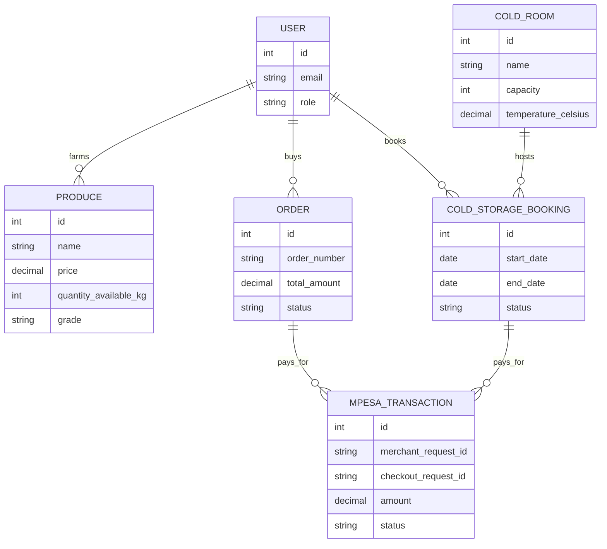

# ERD

```mermaid
erDiagram
    USER ||--o{ PRODUCE : farms
    USER ||--o{ ORDER : buys
    USER ||--o{ COLD_STORAGE_BOOKING : books
    COLD_ROOM ||--o{ COLD_STORAGE_BOOKING : hosts
    ORDER ||--o{ MPESA_TRANSACTION : pays_for
    COLD_STORAGE_BOOKING ||--o{ MPESA_TRANSACTION : pays_for

    USER {
        int id
        string email
        string role
    }

    PRODUCE {
        int id
        string name
        decimal price
        int quantity_available_kg
        string grade
    }

    ORDER {
        int id
        string order_number
        decimal total_amount
        string status
    }

    COLD_ROOM {
        int id
        string name
        int capacity
        decimal temperature_celsius
    }

    COLD_STORAGE_BOOKING {
        int id
        date start_date
        date end_date
        string status
    }

    MPESA_TRANSACTION {
        int id
        string merchant_request_id
        string checkout_request_id
        decimal amount
        string status
    }
```
